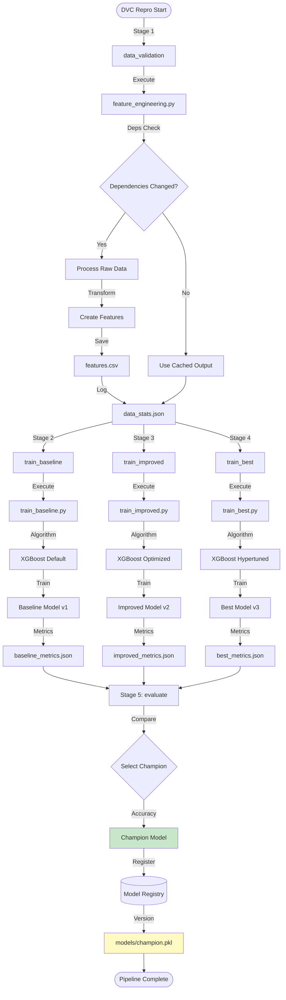
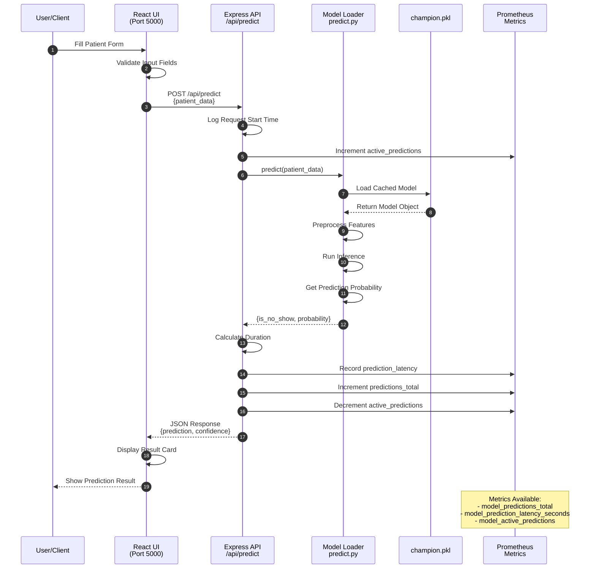
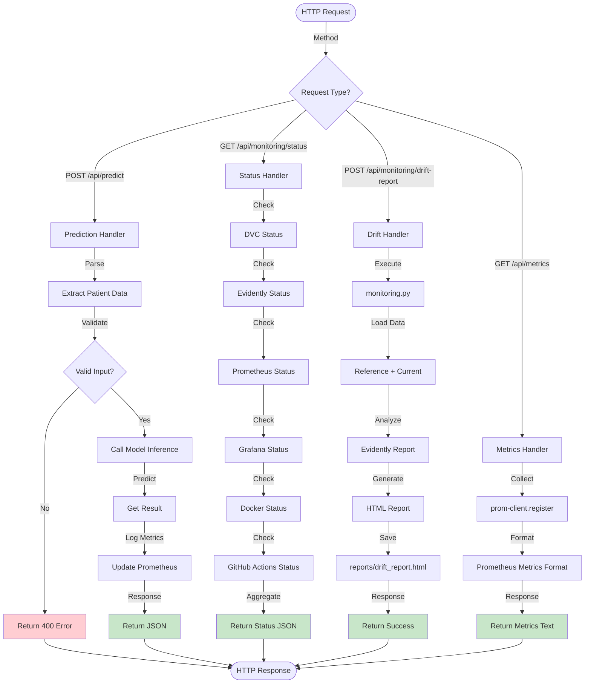

# MLOps Project - Mermaid Workflow Diagrams

## 1. Overall System Architecture

```mermaid
graph TB
    subgraph "Data Layer"
        A[Raw CSV Data<br/>noshow.csv] -->|DVC Track| B[Data Version Control]
        B -->|Version Hash| C[Git Repository]
    end
    
    subgraph "Feature Engineering"
        A -->|Read| D[feature_engineering.py]
        D -->|Process| E[Processed Features]
        E -->|Save| F[features.csv]
    end
    
    subgraph "Training Pipeline"
        F -->|Input| G[train_baseline.py]
        F -->|Input| H[train_improved.py]
        F -->|Input| I[train_best.py]
        G -->|XGBoost| J[Baseline Model]
        H -->|Optimized| K[Improved Model]
        I -->|Hypertuned| L[Best Model]
        J --> M[Model Registry]
        K --> M
        L --> M
    end
    
    subgraph "Evaluation & Selection"
        M -->|Compare| N[evaluate.py]
        N -->|Metrics| O[Best Model Selection]
        O -->|Deploy| P[Production Model]
    end
    
    subgraph "Serving Layer"
        P -->|Load| Q[Express API<br/>Port 5000]
        Q -->|Endpoint| R[/api/predict]
        R -->|Response| S[Client Application<br/>React UI]
    end
    
    subgraph "Monitoring Stack"
        Q -->|Metrics| T[Prometheus<br/>Port 9090]
        T -->|Scrape| U[/api/metrics]
        T -->|Data| V[Grafana<br/>Port 3000]
        V -->|Visualize| W[Dashboards]
        Q -->|Drift Data| X[Evidently AI]
        X -->|Report| Y[drift_report.html]
    end
    
    subgraph "CI/CD"
        C -->|Push| Z[GitHub Actions]
        Z -->|Trigger| AA[Workflows]
        AA -->|Build| AB[Docker Image]
        AB -->|Deploy| AC[GCP Cloud Run]
    end

    style A fill:#e1f5ff
    style P fill:#c8e6c9
    style Q fill:#fff9c4
    style V fill:#ffccbc
```

## 2. CI/CD Pipeline (GitHub Actions)

```mermaid
graph LR
    subgraph "Triggers"
        A[Git Push to main] -->|or| B[Manual Dispatch]
        C[Pull Request] -->|or| D[Scheduled Cron]
    end
    
    A --> E{CI Workflow}
    B --> E
    C --> E
    D --> E
    
    E -->|1| F[Checkout Code]
    F -->|2| G[Setup Python 3.11]
    G -->|3| H[Install Dependencies]
    H -->|4| I[Run Linting]
    I -->|5| J[Type Checking]
    
    J -->|Pass| K{Model Training Workflow}
    K -->|1| L[Setup Environment]
    L -->|2| M[Train Baseline Model]
    M -->|3| N[Train Improved Model]
    N -->|4| O[Train Best Model]
    O -->|5| P[Evaluate Models]
    P -->|6| Q[Upload Artifacts]
    
    Q -->|Artifacts Ready| R{Deployment Workflow}
    R -->|1| S[Build Docker Image]
    S -->|2| T[Tag with version]
    T -->|3| U[Push to GCR]
    U -->|4| V[Deploy to Cloud Run]
    V -->|5| W[Health Check]
    W -->|Pass| X[Deployment Success]
    W -->|Fail| Y[Rollback]
    
    J -->|Fail| Z[Notify Failure]
    P -->|Fail| Z
    
    style X fill:#c8e6c9
    style Y fill:#ffcdd2
    style Z fill:#ffcdd2
```



## 3. DVC Training Pipeline



## 4. Prediction/Inference Flow



## 5. Monitoring & Drift Detection

```mermaid
graph TB
    subgraph "Data Collection"
        A[Express API<br/>Port 5000] -->|Expose| B[/api/metrics Endpoint]
        A -->|Store| C[(Prediction History)]
    end
    
    subgraph "Metrics Scraping"
        B -->|HTTP GET| D[Prometheus Scraper<br/>Every 30s]
        D -->|Store| E[(Time Series DB)]
    end
    
    subgraph "Metrics Types"
        E -->|Counter| F[model_predictions_total]
        E -->|Histogram| G[model_prediction_latency]
        E -->|Gauge| H[model_active_predictions]
    end
    
    F --> I[Grafana Queries]
    G --> I
    H --> I
    
    subgraph "Visualization"
        I -->|Dashboard| J[Grafana UI<br/>Port 3000]
        J -->|Panel 1| K[Total Predictions]
        J -->|Panel 2| L[Active Predictions]
        J -->|Refresh 30s| J
    end
    
    subgraph "Drift Detection"
        C -->|Trigger| M[Generate Drift Report<br/>POST /api/monitoring/drift-report]
        M -->|Execute| N[monitoring.py]
        N -->|Load| O[Reference Dataset]
        N -->|Load| P[Current Predictions]
        O --> Q[Evidently AI]
        P --> Q
        Q -->|Analyze| R{Statistical Tests}
        R -->|KS Test| S[Feature Drift Score]
        R -->|Chi-Square| T[Categorical Drift]
        R -->|PSI| U[Population Stability]
        S --> V[Generate HTML Report]
        T --> V
        U --> V
        V -->|Save| W[reports/drift_report.html]
    end
    
    subgraph "Alerting"
        E -->|Query| X[Alert Rules<br/>alert_rules.yml]
        X -->|Condition| Y{High Drift?}
        Y -->|Yes| Z[Send Alert]
        Y -->|No| AA[Continue Monitoring]
    end
    
    style W fill:#fff9c4
    style J fill:#ffccbc
    style Z fill:#ffcdd2
```

## 6. Model Training Workflow Detail

```mermaid
stateDiagram-v2
    [*] --> DataIngestion
    
    DataIngestion --> FeatureEngineering: Raw CSV Available
    
    state FeatureEngineering {
        [*] --> LoadData
        LoadData --> ParseDates
        ParseDates --> CreateTimeFeatures
        CreateTimeFeatures --> EncodeCategories
        EncodeCategories --> ScaleNumerical
        ScaleNumerical --> [*]
    }
    
    FeatureEngineering --> DataValidation: Features Ready
    
    state DataValidation {
        [*] --> CheckSchema
        CheckSchema --> ValidateTypes
        ValidateTypes --> CheckMissing
        CheckMissing --> StatisticalChecks
        StatisticalChecks --> [*]
    }
    
    DataValidation --> ModelTraining: Validation Passed
    DataValidation --> [*]: Validation Failed
    
    state ModelTraining {
        [*] --> TrainBaseline
        TrainBaseline --> TrainImproved
        TrainImproved --> TrainBest
        
        state TrainBaseline {
            [*] --> XGBoostDefault
            XGBoostDefault --> CrossValidation
            CrossValidation --> SaveBaseline
            SaveBaseline --> [*]
        }
        
        state TrainImproved {
            [*] --> XGBoostOptimized
            XGBoostOptimized --> GridSearch
            GridSearch --> SaveImproved
            SaveImproved --> [*]
        }
        
        state TrainBest {
            [*] --> XGBoostHypertuned
            XGBoostHypertuned --> BayesianOpt
            BayesianOpt --> SaveBest
            SaveBest --> [*]
        }
        
        TrainBest --> [*]
    }
    
    ModelTraining --> Evaluation: 3 Models Trained
    
    state Evaluation {
        [*] --> LoadModels
        LoadModels --> ComputeMetrics
        ComputeMetrics --> CompareAccuracy
        CompareAccuracy --> SelectChampion
        SelectChampion --> [*]
    }
    
    Evaluation --> ModelRegistry: Champion Selected
    
    state ModelRegistry {
        [*] --> SaveChampion
        SaveChampion --> UpdateMetadata
        UpdateMetadata --> VersionTag
        VersionTag --> [*]
    }
    
    ModelRegistry --> Deployment
    Deployment --> [*]
```



## 7. Data Versioning with DVC

```mermaid
graph LR
    subgraph "Local Development"
        A[Modify noshow.csv] -->|Stage| B[dvc add data/raw/noshow.csv]
        B -->|Generate| C[noshow.csv.dvc]
        C -->|Contains| D[MD5 Hash + Metadata]
        D -->|Track| E[git add noshow.csv.dvc]
        E -->|Commit| F[git commit -m 'Update data']
    end
    
    subgraph "Remote Storage"
        F -->|Push Data| G[dvc push]
        G -->|Upload| H[(DVC Remote Cache)]
        H -->|Store| I[Original File by Hash]
    end
    
    subgraph "Team Collaboration"
        J[Teammate] -->|Clone| K[git clone repo]
        K -->|Contains| L[noshow.csv.dvc]
        L -->|Pull Data| M[dvc pull]
        M -->|Download| H
        H -->|Restore| N[noshow.csv]
    end
    
    subgraph "Pipeline Execution"
        N -->|Input| O[dvc repro]
        O -->|Check| P{Hash Changed?}
        P -->|No| Q[Use Cache]
        P -->|Yes| R[Rerun Stage]
        R -->|Output| S[New Artifacts]
        S -->|Track| T[dvc add]
        Q --> U[Pipeline Complete]
        T --> U
    end
    
    style H fill:#e1f5ff
    style U fill:#c8e6c9
```



## 8. API Request Flow



## 9. Frontend Component Architecture

```mermaid
graph TD
    subgraph "React Application"
        A[App.tsx<br/>Main Entry] -->|Route /| B[Dashboard.tsx]
        A -->|Route /predictor| C[Predictor.tsx]
        A -->|Route /monitoring| D[Monitoring.tsx]
        A -->|Route /architecture| E[Architecture.tsx]
    end
    
    subgraph "Dashboard Page"
        B -->|Use Hook| F[usePipeline]
        F -->|Fetch| G[GET /api/pipeline/status]
        G -->|Data| H[Display Metrics Cards]
        H --> I[Recent Runs Table]
        H --> J[Model Comparison Chart]
    end
    
    subgraph "Predictor Page"
        C -->|Use Hook| K[usePredictions]
        C -->|Form| L[Patient Input Form]
        L -->|Submit| M[POST /api/predict]
        M -->|Response| N[Prediction Result Card]
        N -->|Display| O[Confidence Score]
        N -->|Display| P[Risk Assessment]
    end
    
    subgraph "Monitoring Page"
        D -->|Fetch| Q[GET /api/monitoring/status]
        Q -->|Data| R[Component Status Cards]
        R --> S[DVC Card]
        R --> T[Evidently Card]
        R --> U[Prometheus Card]
        R --> V[Grafana Card]
        R --> W[Docker Card]
        R --> X[GitHub Actions Card]
        D -->|Button| Y[Generate Drift Report]
        Y -->|POST| Z[/api/monitoring/drift-report]
    end
    
    subgraph "Architecture Page"
        E --> AA[System Diagram]
        E --> AB[Tech Stack Cards]
        E --> AC[Component Details]
    end
    
    subgraph "Shared Components"
        AD[Layout.tsx<br/>Navigation] --> A
        AE[UI Components<br/>shadcn/ui] --> B
        AE --> C
        AE --> D
        AE --> E
    end
    
    style N fill:#c8e6c9
    style H fill:#fff9c4
    style R fill:#ffccbc
```

## Usage Instructions

To use these diagrams:

1. **GitHub/GitLab**: Most support Mermaid natively in markdown files
2. **VS Code**: Install "Markdown Preview Mermaid Support" extension
3. **Mermaid Live Editor**: https://mermaid.live/
4. **Documentation**: Copy into README.md or docs

Each diagram represents a different aspect of the MLOps pipeline workflow.
