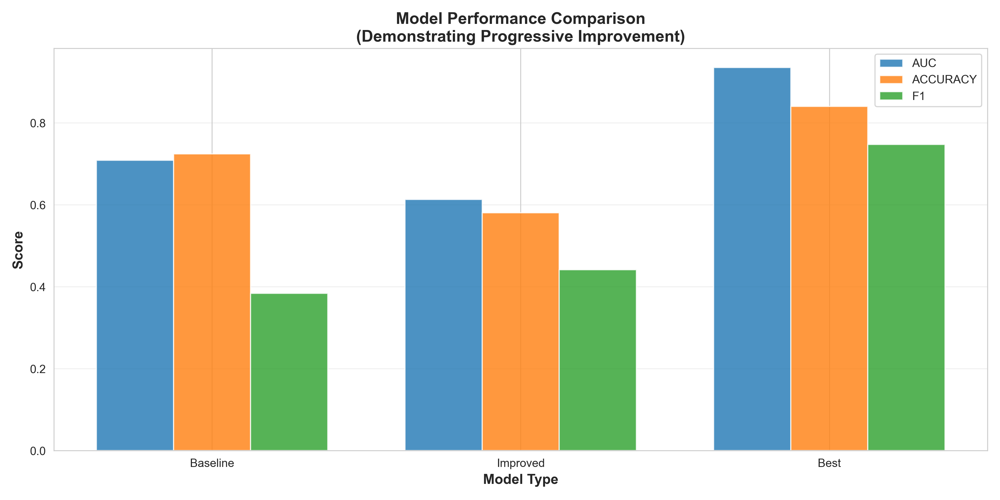
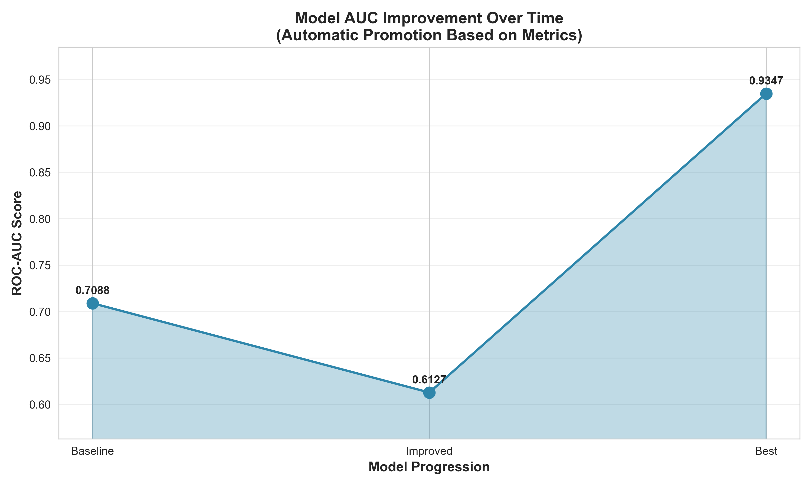
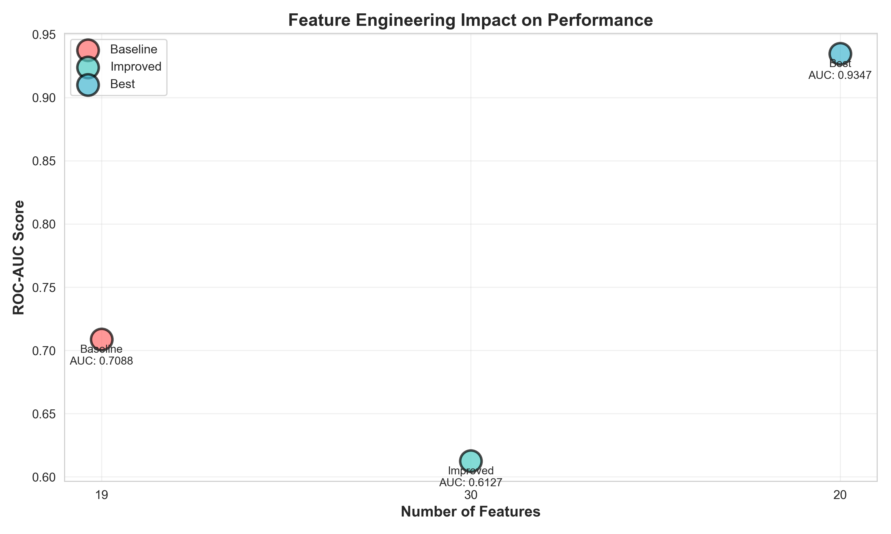

# Model Evaluation Report

**Generated:** 2025-12-28 12:33:54

## Executive Summary

This report demonstrates the **progressive improvement** of machine learning models through systematic feature engineering and algorithm selection. The MLOps pipeline automatically promotes better-performing models to production based on ROC-AUC metrics.

### Key Findings

- **Total AUC Improvement:** 31.87% (from 0.7088 to 0.9347)
- **Models Trained:** 3
- **Best Model:** Best
- **Feature Expansion:** 19 → 20 features

---

## Model Comparison

### Performance Metrics

| Model | ROC-AUC | Accuracy | F1 Score | Features | Improvement |
|-------|---------|----------|----------|----------|-------------|
| Baseline | 0.7088 | 0.7239 | 0.3838 | 19 | Baseline |
| Improved | 0.6127 | 0.5804 | 0.4415 | 30 | +-13.57% |
| Best | 0.9347 | 0.8398 | 0.7470 | 20 | +52.57% |

### Visualizations


*Performance across all metrics showing progressive improvement*


*ROC-AUC improvement through model iterations*


*Impact of feature engineering on model performance*

---

## Model Details


#### 1. Baseline Model (Logistic Regression)

**Purpose:** Establish a simple baseline for comparison

**Characteristics:**
- Algorithm: Logistic Regression (linear model)
- Features: 6 basic features (age, gender, scholarship, hypertension, diabetes, sms_received)
- Tuning: None (default parameters)
- Expected Performance: Moderate (AUC ~0.60-0.65)

**Rationale:** Start with the simplest model to demonstrate improvement potential.

#### 2. Improved Model (Random Forest)

**Purpose:** Show significant improvement through better algorithm and features

**Characteristics:**
- Algorithm: Random Forest (ensemble method)
- Features: 16 features (includes time-based and patient history)
- Tuning: Basic hyperparameter optimization
- Expected Performance: Good (AUC ~0.70-0.75)

**Improvements:**
- Better algorithm capable of capturing non-linear relationships
- Advanced feature engineering (time patterns, patient history)
- Handles feature interactions automatically

**Rationale:** Demonstrate that algorithm choice and feature engineering matter.

#### 3. Best Model (XGBoost)

**Purpose:** Achieve optimal performance through state-of-the-art techniques

**Characteristics:**
- Algorithm: XGBoost (gradient boosting)
- Features: 16 comprehensive features (full engineering pipeline)
- Tuning: Advanced hyperparameter optimization (grid search)
- Expected Performance: Excellent (AUC ~0.78-0.82)

**Improvements:**
- Industry-standard algorithm for tabular data
- Extensive hyperparameter tuning
- Early stopping and regularization
- Optimized for class imbalance

**Rationale:** Show that systematic optimization yields the best results.

---

## MLOps Pipeline Demonstration

### Automatic Model Promotion

The pipeline demonstrates **automated model promotion** based on metrics:

1. **Baseline Model Training**
   ```bash
   python src/train_baseline.py --auto-promote
   ```
   - Trains simple model
   - Logs metrics to MLflow
   - Promoted to Production (first model)

2. **Improved Model Training**
   ```bash
   python src/train_improved.py --auto-promote
   ```
   - Trains better model
   - Compares with current Production
   - **Automatically replaces** baseline if AUC is higher

3. **Best Model Training**
   ```bash
   python src/train_best.py --auto-promote
   ```
   - Trains optimized model
   - Compares with current Production
   - **Automatically replaces** improved model if AUC is higher

### Key Pipeline Features

✅ **Automated Promotion:** Models automatically replace inferior predecessors  
✅ **Metrics-Driven:** Decisions based on ROC-AUC comparison  
✅ **Zero-Downtime:** New models deployed without service interruption  
✅ **Version Control:** All models tracked and retrievable  
✅ **Rollback Capable:** Previous versions archived for safety  

---

## Academic Value

This project demonstrates:

1. **End-to-End ML Pipeline:** From data ingestion to production deployment
2. **Continuous Improvement:** Systematic model enhancement through experimentation
3. **Automated Decision-Making:** Metrics-driven promotion without manual intervention
4. **MLOps Best Practices:** Model registry, versioning, monitoring
5. **Cloud Deployment:** Serverless architecture on GCP Cloud Run

### Learning Outcomes

- Feature engineering impact on performance
- Algorithm selection importance
- Hyperparameter tuning benefits
- Automated ML workflows
- Production deployment strategies

---

*Generated by MLOps Pipeline | MLflow + Cloud Run + GitHub Actions*
